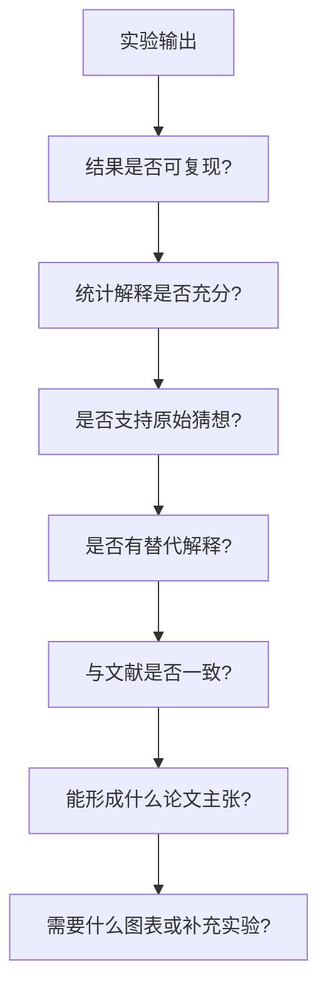

# 从实验结果到论文主张

实验结果不能直接等于论文贡献。这个文件定义一个中间层：把实验输出转成可验证、可复现、可写作的证据链。

## 结果解释顺序



## 结果状态

| 状态 | 含义 | 下一步 |
|---|---|---|
| supports | 支持猜想 | 检查效应量、稳健性、替代解释 |
| contradicts | 反驳猜想 | 修正理论、寻找边界条件 |
| inconclusive | 不确定 | 补数据、补实验、检查测量 |
| artifact | 可能是程序/数据问题 | 调试、复现、审计数据 |
| exploratory | 只能作为探索发现 | 标记为探索性，不写成强结论 |

## Claim-Evidence Map

每个准备写进论文的主张都应该有：

- Claim: 准备写进论文的一句话。
- Evidence: 对应实验结果、图表或文献。
- Strength: strong / moderate / weak / exploratory。
- Risks: 替代解释、偏误、样本限制。
- Needed: 还需要补什么。

## 用户可以怎么说

```text
请把这个实验结果转成 claim-evidence map，并告诉我哪些主张可以写进论文，哪些只能作为探索性发现。
```

