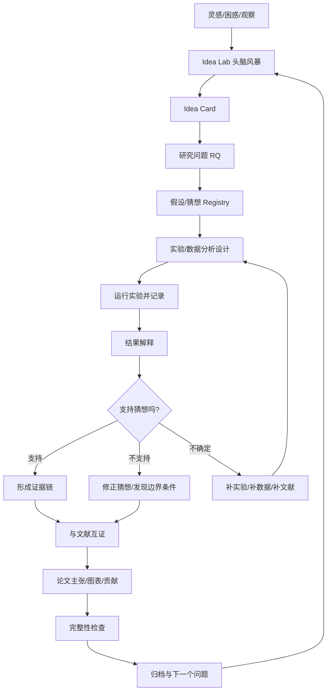

# 快乐科研闭环

这份文档描述 ResearchWorkflow 最理想的使用方式：你用简单对话提出兴趣、困惑、数据或结果，Codex 负责把它们组织成可研究的问题、可执行实验、可复现结果和可写入论文的证据链。

## 一句话入口

```text
我想快乐科研。请你从我的想法出发，帮我产生研究问题，设计实验，分析结果，验证猜想，并把结果和文献一起提升成论文贡献。
```

## 总闭环



## 使用者真正要做什么

你主要做三件事：

1. 说出你的想法、困惑、数据、结果或目标。
2. 对关键判断做确认，例如“这个方向值得继续”“这个解释更合理”。
3. 阅读我整理出的证据链和论文主张，决定是否推进。

你不需要手工整理文件、文献、日志、实验记录或周总结。

## Codex 应该主动做什么

| 阶段 | Codex 的工作 | 产物 |
|---|---|---|
| 灵感 | 追问、发散、联系已有知识 | brainstorm session |
| 想法 | 保存成 idea card，标记前沿核查 | idea card |
| 问题 | 收敛为 RQ，检查 FINER | RQ summary |
| 猜想 | 把想法变成可检验假设 | hypothesis registry |
| 实验 | 设计数据、变量、步骤、命令 | experiment plan |
| 运行 | 执行命令、记录日志和环境 | run report |
| 复现 | 对比两次输出，检查差异 | reproducibility report |
| 解释 | 解释结果、效应量、限制 | result interpretation |
| 互证 | 把结果与文献矩阵对齐 | claim-evidence map |
| 写作 | 转成论文段落、图表和贡献 | manuscript section |

## 最简单的对话流程

### 1. 从灵感开始

```text
我最近想到一个问题：X。你先不要急着定题，帮我头脑风暴，看看它能不能变成研究。
```

### 2. 从数据开始

```text
我有一批数据，但还不知道能研究什么。你先帮我看数据结构，再引导我形成可检验的猜想。
```

### 3. 从实验开始

```text
我想验证这个猜想：X。请你帮我设计实验步骤、变量、分析方法和复现方案。
```

### 4. 从结果开始

```text
这是实验结果。请你判断它支持还是反驳我的猜想，指出统计和解释风险，并告诉我还要补什么。
```

### 5. 从论文开始

```text
把这些实验结果和文献矩阵结合起来，帮我提炼一个更高层次的论文主张。
```

## 让科研变轻松的关键规则

- 每次只推进一个小闭环，不一次性做完所有事。
- 任何结果都可以产生价值：支持、反驳、不确定，都能帮助收敛问题。
- 不把“结果显著”直接等同于“贡献成立”。
- 不把“结果不显著”视为失败，要看是否发现边界条件、测量问题或理论缺口。
- 每个论文主张都要同时连接：文献、数据、图表、实验记录。

## 快乐科研的日常节奏


每天结束时你可以说：

```text
今天先到这里。请你把今天的想法、实验、结果和下一步整理成一个快乐科研闭环记录。
```

## 当前还要继续改进的地方

- 自动从数据文件生成数据字典。
- 自动把实验输出转成 result card。
- 自动把 result card 和 literature matrix 做主张对齐。
- 更完整的复现比较：支持图片、模型指标、随机实验误差范围。
- 更自然的“下一步推荐”：根据你的精力、项目成熟度和开放问题推荐一个轻量任务。

