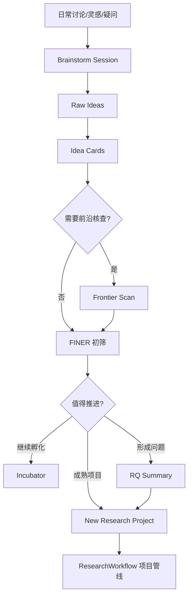

# Idea Lab: 科研想法孵化与头脑风暴

Idea Lab 是 ResearchWorkflow 的想法孵化系统。它的目标不是一次性给你几个论文题目，而是长期积累你和 Codex 的讨论、已有知识、文献矩阵、前沿扫描和灵感碎片，并逐步把它们推进为可研究的问题、实验和论文项目。

## 核心原则

- 先探索，再收敛。
- 先提问，再定题。
- 先记录想法，再判断价值。
- AI 可以提出方向，但不能把未验证的“前沿”当事实。
- 当涉及最新研究前沿时，必须检索或核查当前文献。

## 工作流



## 你什么时候用

| 场景 | 你可以直接说 |
|---|---|
| 你脑子里有一个模糊想法 | “帮我开一个头脑风暴会话，围绕这个想法慢慢挖。” |
| 你不知道该做什么新研究 | “结合我们已有积累和领域前沿，帮我引导出几个新研究方向。” |
| 你想把灵感保存下来 | “把这个想法做成 idea card，先放入孵化池。” |
| 你担心题目不够新 | “对这个想法做前沿扫描，看看最近研究到哪了。” |
| 你想把想法变成论文项目 | “把这个 idea card 推进成研究问题和项目。” |

## Codex 应该怎么做

1. 读取 `current_context.md`、`user_model.md`、`open_loops.md`。
2. 查看 `library/literature_matrix.csv` 和 Obsidian 中已有概念/文献/方法笔记。
3. 创建 brainstorm session。
4. 通过 Socratic 问题引导，而不是直接替用户定题。
5. 将有价值的想法保存为 idea card。
6. 对需要前沿判断的想法执行文献/网络检索。
7. 用 FINER 做初筛。
8. 成熟后再创建正式研究项目。

## 目录

- `vault/11_Idea_Lab/sessions/`: 每次头脑风暴会话。
- `vault/11_Idea_Lab/idea_cards/`: 单个可追踪想法。
- `vault/11_Idea_Lab/frontier_scans/`: 前沿扫描记录。
- `vault/11_Idea_Lab/incubator/`: 暂时不成熟但值得保留的想法。
- `vault/11_Idea_Lab/promoted_projects/`: 已推进为正式项目的想法记录。
- `vault/11_Idea_Lab/idea_index.csv`: 想法索引。

## 命令

```bash
make idea-start TOPIC="你的想法或问题"
make idea-status
```

创建 idea card:

```bash
/Users/leung/anaconda3/bin/python scripts/idea_lab.py add \
  --title "想法标题" \
  --summary "一句话想法" \
  --domain "领域" \
  --frontier-needed
```

通常你不需要自己运行这些命令。你只需要告诉 Codex：

```text
帮我把这个想法放进 Idea Lab，并引导我继续挖。
```

## Idea 成熟度

| 阶段 | 含义 | 下一步 |
|---|---|---|
| seed | 灵感刚出现 | 追问、扩展、记录 |
| incubating | 有潜力但还不清楚 | 补文献、补场景、补方法 |
| frontier-check | 需要前沿核查 | 检索最新文献 |
| rq-ready | 可以形成研究问题 | 生成 RQ Summary |
| project-ready | 可以成为正式项目 | 创建 ResearchWorkflow 项目 |
| archived | 暂不推进 | 保留以备未来重组 |

