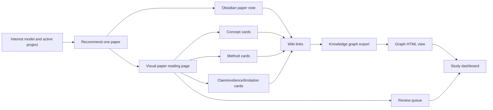
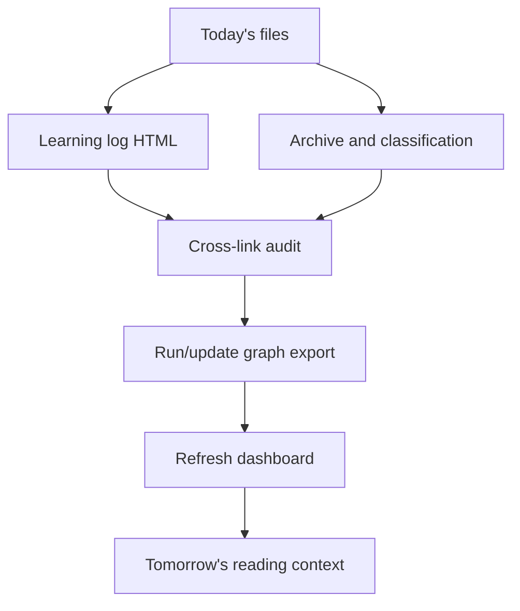

# Integrated Research Learning Workflow

Last updated: 2026-06-29

This document defines how daily paper reading, knowledge cards, the knowledge graph, learning logs, and project work should connect. It is the contract that scheduled Codex tasks should follow.

## Design Goal

The workflow should make one daily paper become four reusable assets:

1. A readable paper deep-reading page.
2. A small set of knowledge cards.
3. New knowledge-graph relations.
4. A learning log entry and next action.

The user should be able to enter from `study_dashboard.html`, then move from paper to cards, graph, review questions, and project actions without hunting through folders.

## Daily Morning Pipeline



Required outputs for every new deep-read paper:

| Output | Path | Purpose |
|---|---|---|
| Paper today entry | `paper_reading/today.html` | Stable daily entry that always opens the latest recommended deep-read page. |
| Paper visual page | `paper_reading/YYYY-MM-DD-short-title.html` | Browser-first reading page. |
| Browser mirror pages | `paper_reading/views/*.html`, `knowledge_cards/views/*.html`, `logs/views/*.html` | User-facing HTML mirrors for Markdown sources linked from daily pages, cards, and logs. |
| Paper index | `paper_reading/index.html` | Timeline of daily papers. |
| Paper note | `vault/01_Literature/<citekey-or-slug>.md` | Obsidian/source-grounded literature note. |
| Concept cards | `vault/02_Concepts/*.md` | Key theories, constructs, and ideas. |
| Method cards | `vault/03_Methods/*.md` | Research designs, models, metrics, and analyses. |
| Knowledge index | `vault/13_Knowledge_Graph/knowledge_index.csv` | Searchable card registry. |
| Graph CSV | `vault/13_Knowledge_Graph/obsidian_nodes.csv`, `obsidian_edges.csv` | Exported relation data. |
| Graph HTML | `knowledge_graph/index.html` | Human-friendly relationship view. |
| Review queue | `vault/14_Review_Queue/review_queue.csv` | Spaced review prompts. |
| Dashboard | `study_dashboard.html` | Daily visual entry point. |

## Artifact Contract

Each paper visual page should include:

- Metadata: title, authors, year, venue, DOI/link, project role.
- Why read it today: fit with user interests and current project stage.
- Reading route: 30-second orientation, core content, evidence boundary, innovation/limitation/opportunity.
- Evidence logic: research question, method, data, main findings, figures/tables, claim strength.
- Knowledge extraction: 3-7 concepts/methods worth turning into cards.
- Graph relations: paper -> concept, paper -> method, concept -> method, paper -> project, limitation -> idea.
- Review questions: 2-3 questions for active recall.
- Next action: what to read, verify, write, or test next.

Each Obsidian paper note should include wiki links to the created/updated cards:

```text
## Knowledge Links

- Concepts: [[Concept A]], [[Concept B]]
- Methods: [[Method A]]
- Project: [[library_short_video]]
- Opportunities: [[Idea or Research Question]]
```

Each concept or method card should link back to the source paper and project:

```text
## 来源论文

- [[paper-citekey-or-title]]

## 可用于我的研究

- [[library_short_video]]
```

## Daily Evening Pipeline



The evening task should verify:

- The paper page links to its paper note, cards, graph view, and learning log.
- Every new card links back to at least one paper or project.
- `make obsidian-graph` runs after card/note updates.
- `make learning-dashboard` runs after graph export.
- `make workflow-backup` runs after user-facing or evidence-state changes.
- `make git-snapshot PUSH=1` or `make workflow-refresh-git` pushes trackable text assets to the private Git remote; raw PDFs, CAJ/KDH files, zip backups, caches, and large binaries stay out of Git.
- `make workflow-audit` reports zero FAIL items before closeout.
- Orphan files are reported in the daily log, not deleted.

## Usability Rules

- Prefer a single visual entry: `study_dashboard.html`.
- Daily reading should also keep a stable direct entry: `paper_reading/today.html`.
- Keep daily pages self-contained with inline CSS so they open directly in a browser.
- Markdown remains the canonical research memory; HTML is the reading and review surface.
- User-facing links from daily pages, dashboards, cards, logs, and graph pages should point to HTML mirror pages, not raw local Markdown.
- Raw Markdown links are allowed only as explicit "open source/raw Markdown" controls inside mirror pages for editing or verification.
- `make learning-dashboard` should generate HTML mirrors for linked Markdown files and rewrite local Markdown links in daily paper pages to those mirrors.
- `knowledge_graph/index.html` should default to a visual, interactive graph view. CSV/table links are secondary source-data links, not the primary interface.
- `workflow_health.html` is the browser-first workflow health page. It should be refreshed by `make workflow-audit`.
- `backups/index.html` is the browser-first backup index. It should be refreshed by `make workflow-backup`.
- Daily closeout should prefer the sequential no-race command `make workflow-refresh-git DATE=<YYYY-MM-DD>` when remote backup is desired, or `make workflow-refresh DATE=<YYYY-MM-DD>` for local-only refresh.
- Use stable filenames with dates and short slugs.
- Never delete uncertain files during automation; classify as "needs review".
- Every new knowledge point should have a review prompt or a reason why no review is needed.

## Daily Closeout Command

Use this after evidence, links, or user-facing pages change:

```bash
make workflow-refresh DATE=2026-06-29 NOTE="daily closeout"
```

Use this variant when the result should also be committed and pushed to the private Git remote:

```bash
make workflow-refresh-git DATE=2026-06-29 NOTE="daily closeout"
```

It runs, in order:

1. `make obsidian-graph`
2. `make learning-dashboard`
3. `make workflow-backup`
4. `make codex-sweep`
5. `make codex-compact`
6. `make codex-context-index`
7. `make workflow-audit`
8. final `make learning-dashboard` to surface the latest audit/backup links on the dashboard

The Git variant adds two safe snapshots:

1. Commit and push the refreshed research assets.
2. Refresh Git health in `workflow_health.html`, then commit and push that final audit state.

Do not parallelize these commands: dashboard generation and audit both read/write the same HTML entry pages, so running them concurrently can create false alarms.
