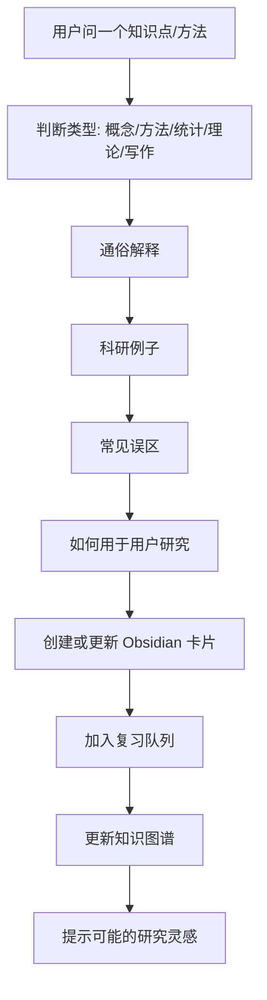

# Knowledge Coach: 科研知识导师与方法训练

这个模块用于解决一个现实问题：用户科研基础还在提升阶段，经常会遇到概念、理论、统计方法、研究设计、论文写法不懂。Codex 不应只回答一次，而应帮助用户真正理解、记住、复用，并把知识沉淀到 Obsidian 知识图谱。

## 核心目标

- 用通俗语言解释难知识。
- 用科研例子说明如何使用。
- 记录常见误区。
- 创建 Obsidian 概念卡片和方法卡片。
- 生成复习问题，帮助反复理解和记忆。
- 建立概念、方法、文献、项目、想法之间的双链。
- 从知识图谱中寻找新的研究灵感。

## 每次用户问知识点时，Codex 应该怎么做

## 回答风格

Codex 回答知识点时，默认使用这个结构：

1. **一句话解释**：先用最短的话说清楚。
2. **通俗比喻**：用生活或简单研究场景解释。
3. **科研例子**：说明它在论文、实验或数据分析中怎么用。
4. **常见误区**：指出最容易理解错的地方。
5. **怎么记**：给一个记忆钩子。
6. **怎么用到你的研究**：连接当前项目、Idea Lab 或文献矩阵。
7. **Obsidian 归档**：创建或更新概念/方法卡片。

## 目录

- `vault/02_Concepts/`: 概念卡片。
- `vault/03_Methods/`: 科研方法卡片。
- `vault/12_Learning_Log/sessions/`: 每次学习会话。
- `vault/13_Knowledge_Graph/`: 知识索引和 Gephi 导出。
- `vault/14_Review_Queue/`: 复习队列。

## 你可以怎么说

| 场景 | 你可以直接说 |
|---|---|
| 不懂一个概念 | “用通俗例子教我 X，并帮我做成 Obsidian 知识卡片。” |
| 不懂一个方法 | “教我 X 方法，它适合什么问题，怎么在论文里用。” |
| 想复习 | “今天帮我复习最近学过但还没掌握的科研方法。” |
| 想看知识图谱 | “导出我的 Obsidian 知识图谱，看看哪些方向最密集。” |
| 想找灵感 | “从我的知识图谱里找几个可能的新研究方向。” |

## 知识卡片成熟度

| 状态 | 含义 | 下一步 |
|---|---|---|
| learning | 刚学过，还需要复习 | 用例子复述 |
| familiar | 能理解基本含义 | 做科研应用题 |
| usable | 能用于项目或论文 | 连接到项目/文献 |
| mastered | 能解释给别人 | 从中产生新研究想法 |

## 复习节奏

默认复习间隔：

- 第 1 次：明天。
- 第 2 次：3 天后。
- 第 3 次：7 天后。
- 第 4 次：14 天后。
- 第 5 次：30 天后。

Codex 不能后台自动提醒，但在活跃会话中应主动检查 `review_queue.csv`，提醒今天应该复习什么。

## 与科研产出的连接

每个知识点不只是“学会”，还要尽量连接到：

- 一个研究问题。
- 一个方法。
- 一篇文献。
- 一个实验。
- 一个图表。
- 一个论文主张。
- 一个 Idea Lab 新想法。

这样知识库会逐渐变成科研灵感地图，而不是孤立笔记。

