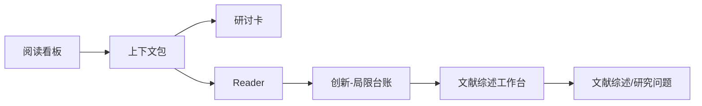

# 论文阅读产出标准

Last updated: 2026-06-30

本标准用于解决三个问题：

1. 用户不知道论文该从哪里读。
2. Codex 带读时容易重复加载完整 Reader，浪费 token。
3. 研讨卡、Reader、创新台账职责混在一起，后续复用困难。

系统分层边界见 `docs/WORKFLOW_LAYERED_ARCHITECTURE.md`。论文阅读产物必须服从该文档的 Source / Processing / Knowledge / Presentation / QA 分层约束。

## 默认阅读顺序



## 固定浏览呈现

每天的论文精读必须优先服务“点开就能看”：

- 固定入口是 `paper_reading/today.html`，它自动打开最新主读论文页。
- 主读论文页必须是完整 HTML 精读页，包含阅读路线、证据逻辑、方法流程、知识卡、复习问题和今日行动。
- 主读页、Vault 首页镜像、Reader、Obsidian 论文笔记、文献综述工作台、知识卡、日志和项目台账里的本地链接，默认都应指向 HTML 镜像页。
- Markdown 是知识库源文件，不是默认浏览入口；生成页可以显示源文件路径，但不要提供可点击的裸 Markdown 链接。
- 每次沉淀完成后必须运行 `make obsidian-graph && make learning-dashboard`，让脚本生成/刷新 `paper_reading/views/`、`paper_reading/views/directories/`、`knowledge_cards/views/`、`logs/views/` 和各入口页。
- `make learning-dashboard` 必须同步刷新 `vault/13_Knowledge_Graph/artifact_manifest.csv`，记录源文件和默认 HTML 展示页的对应关系。
- 如果任一用户侧 HTML 页面误留了本地 `.md` 链接，`make learning-dashboard` 会自动生成对应 HTML 镜像并把链接改过去；不要把裸 Markdown 链接留作用户侧入口。
- 知识图谱入口必须默认显示可视化图谱；CSV 或表格只能作为核对用的源数据入口。

## 四类文件的职责

| 文件类型 | 主要读者 | 该保留什么 | 不该承担什么 |
|---|---|---|---|
| 阅读看板 | 用户 | 今天读什么、入口、进度、下一步提示 | 不塞全文细节 |
| 上下文包 | Codex + 用户 | 带读压缩摘要、核心证据 block、创新局限摘录 | 不替代原文核验 |
| 研讨卡 | 用户 + Codex | 一句话概括、角色判断、研究对象、方法、主要发现、研讨问题、证据锚点 | 不保存全文 block |
| Reader | Codex + 后续写作 | 原文抽取块、source ID、Reading Notes、证据边界 | 不做唯一用户入口 |
| 创新-局限台账 | 选题阶段 | 创新类型、局限类型、可转化问题、机会编号 | 不替代 evidence gate |
| 文献综述工作台 | 综述/论文规划阶段 | 逐篇结论表、逻辑分类、综述线索、阶段性论文工作总结、禁忌边界 | 不替代正式论文正文，不把未读文献写成证据 |

## Codex 带读一篇论文的流程

### 第 1 层：30 秒定位

回答：

- 这篇论文在项目里是什么角色？
- 它是基础文献、方法模板、综述地图、案例证据，还是反面提醒？
- 今天为什么读它？

### 第 2 层：核心内容

回答：

- 研究问题是什么？
- 研究对象和样本是什么？
- 用了什么理论/模型？
- 方法和数据是什么？
- 主要结论是什么？

### 第 3 层：证据和边界

回答：

- 哪些 block 支撑核心判断？
- 哪些结论只能算相关，不能算因果？
- 样本、指标、平台、时间窗口有什么外推限制？
- 如果以后写论文，需要补哪类页码或原文核验？

### 第 4 层：创新、局限、机会

回答：

- 可复用创新点是什么？
- 关键局限是什么？
- 它能转化出哪些研究问题？
- 它和已读文献之间有什么一致、冲突或互补？

## 研讨卡推荐字段

每张研讨卡至少保留：

```text
元数据
阅读状态和证据边界
一句话概括
本项目角色
研究对象/样本
理论/模型
方法与变量
核心发现
可用证据锚点
创新点
局限性
与已读文献的关系
研讨问题
下一步行动
```

## 上下文包推荐字段

每个上下文包至少保留：

```text
用途说明
元数据
Reader Reading Notes
研讨卡核心理解
研讨问题
创新-局限-机会摘录
核心证据 block 快照
带读顺序
下次对 Codex 说什么
```

## Token 使用规则

- 共读开始时，优先加载上下文包。
- 只有当用户要求核验、补证据、解释具体段落、做全文精读时，才打开完整 Reader。
- 写作引用前必须回到 Reader block 和原文页码，不能只引用上下文包。
- 每次带读结束后，只把稳定结论写入研讨卡、综述和创新-局限台账，不把临时聊天内容全量塞入热上下文。
- 多篇文献进入写作前，先经过文献综述工作台；只有逻辑分类和证据边界稳定后，再写正式综述正文。

## 文献综述工作台

工作台用于把短视频式提示词沉淀为稳定流程：

1. 逐篇文献主要结论汇总：研究主题、对象/数据、理论/方法、主要结论、与本项目关系、可放入哪一类文献。
2. 文献逻辑分类：每类文献的共同观点、差异、不足和自然引出的后续问题。
3. 适合写进综述的逻辑线索：避免按作者年份罗列，改写成研究递进。
4. 禁忌边界：不直接代写长正文，不编造文献，不把 metadata-only 当证据，关系弱就直接说明。

通用说明见：

```text
docs/LITERATURE_REVIEW_WORKBENCH.md
```

## 命令

```bash
make paper-context PROJECT=library_short_video CITEKEY=<citekey>
make paper-context PROJECT=library_short_video ALL=1
make reading-board PROJECT=library_short_video
make lit-workbench PROJECT=library_short_video
```
