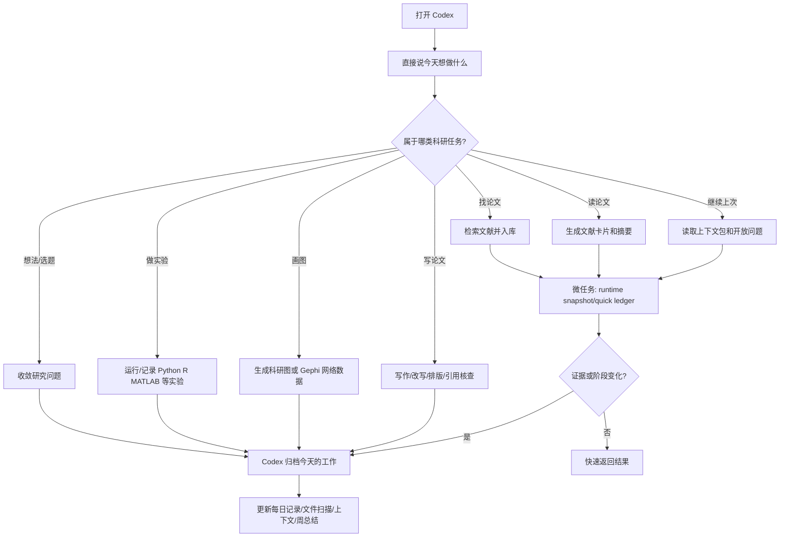
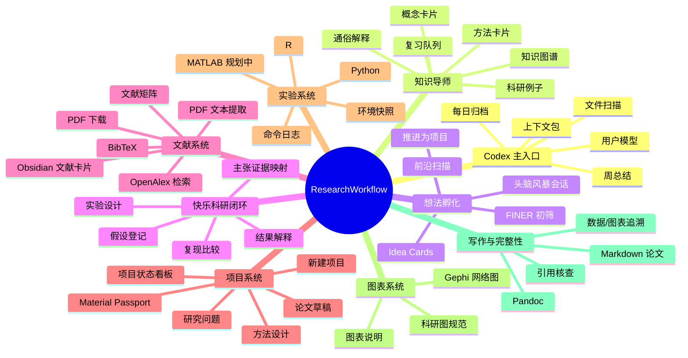
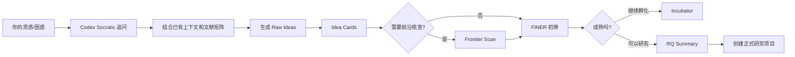
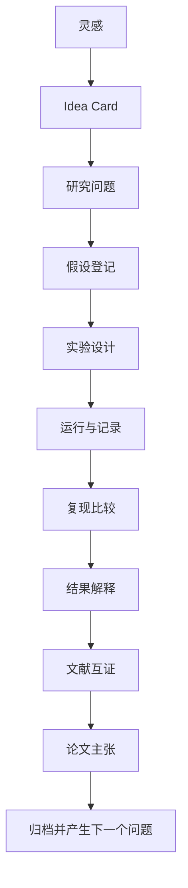
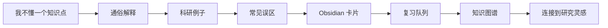
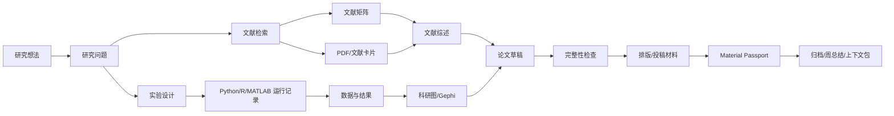

# ResearchWorkflow 可视化使用指南

这份文档面向使用者。你不需要手工整理文件、文献、日志或周总结；你只需要通过 Codex 说清楚你想做什么，Codex 负责执行、归档、总结和维护上下文。

## 先看这个入口

如果你只是想知道“我现在该点哪里、读什么、这些文件有什么用”，不要先读完整手册，先打开：

```text
/Users/leung/ResearchWorkflow/study_dashboard.html
```

这是“今日工作台”：页面顶部会告诉你今日主任务、推荐理由、打开入口、复制命令和完成后下一步。

当前 `library_short_video` 项目的论文阅读入口是：

```text
/Users/leung/ResearchWorkflow/paper_reading/today.html
```

如果只是复盘已读论文或继续共读，优先打开省 token 的论文上下文包：

```text
/Users/leung/ResearchWorkflow/projects/library_short_video/literature/context_packs/
```

如果只是想快速知道当前项目状态或下一篇推荐，不需要触发完整归档链，优先走 fast-lane：

```bash
make fast-status PROJECT=library_short_video TOPIC="图书馆短视频相关研究" PRINT=1
```

如果只是想看菜单，不想记命令：

```bash
make rw
```

架构说明见：

```text
/Users/leung/ResearchWorkflow/docs/WORKFLOW_ARCHITECTURE_FASTLANE.md
```

你也可以直接说：

```text
打开科研首页，按用户视角告诉我今天怎么继续。
```

## 1. 你每天怎么用



最简单的使用方式：

> “继续上次科研工作，先帮我看当前进度，然后告诉我今天应该做什么。”

## 2. 总体功能地图



## 3. 已经实现的功能

| 功能 | 状态 | 作用 | 你什么时候用 | 你只需要怎么说 |
|---|---:|---|---|---|
| Codex 会话启动 | 已实现 | 读取当前上下文、开放问题、用户模型 | 每次继续科研时 | “继续上次科研工作，先读取上下文。” |
| Fast-lane 快速状态 | 已实现 | 从矩阵、推荐状态、Reader、context pack 和 evidence gate 缓存生成轻量快照，避免小任务触发完整归档 | 查下一篇推荐、看项目当前状态、快速续读时 | “用快速模式告诉我下一篇该读什么。” |
| 上下文压缩 | 已实现 | 把长每日日志压缩成摘要和索引，默认只读 hot context，减少 token 消耗 | 长对话、每天都有大量记录后 | “压缩今天的日志并更新 context index。” |
| Typora Markdown 预览 | 已实现 | 用 Typora 打开 Codex 生成的 Markdown，方便你阅读和人工修改 | 看论文草稿、项目看板、精读笔记、周总结时 | “用 Typora 打开这份 Markdown。” |
| 每日归档 | 已实现 | 记录当天目标、讨论、文件、决定、下一步 | 每次有实质科研进展后 | “把今天的工作归档一下。” |
| 每周总结 | 已实现 | 汇总本周问题、决策、文件、开放任务 | 每周结束或你想复盘时 | “帮我做本周科研总结。” |
| 上下文包 | 已实现 | 长对话后压缩关键信息，避免上下文丢失 | 聊很久、项目变复杂时 | “整理一个上下文包，方便下次继续。” |
| 用户模型 | 已实现 | 记录你的偏好、思考方式、协作要求 | 长期协作中自动维护 | “更新一下你对我工作方式的理解。” |
| 文件活动扫描 | 已实现 | 记录当天新增/修改了哪些文件 | 每天收尾时 | “扫描今天产生的文件并归档。” |
| Idea Lab 头脑风暴 | 已实现 | 把灵感、问题、前沿信号沉淀成 idea cards | 不知道做什么新研究、想找新方向时 | “帮我开一个头脑风暴会话，引导我产生新科研想法。” |
| Idea Cards | 已实现 | 保存单个想法及其意义、方法、FINER 初筛 | 某个想法值得保留但还不成熟时 | “把这个想法做成 idea card，先放入孵化池。” |
| 快乐科研闭环 | 已实现 | 把灵感、假设、实验、结果和论文主张连接起来 | 想轻松推进完整科研闭环时 | “我想快乐科研，请你带我从想法走到实验和论文贡献。” |
| 假设登记 | 已实现 | 把猜想变成可检验对象 | 你说“我猜/我觉得/我想验证”时 | “把这个猜想登记成 hypothesis。” |
| 结果解释 | 已实现 | 判断实验结果支持、反驳还是无法判断猜想 | 实验产生结果后 | “解释这个结果，看看它支持还是反驳我的猜想。” |
| 主张证据映射 | 已实现 | 把实验结果、文献和论文主张对齐 | 准备写论文结果/讨论时 | “把结果转成 claim-evidence map。” |
| 投稿/汇报生产层 | 已实现 | 借鉴 nature skills，把术语表、图件合同、润色记录、PPT 资产清单和审稿回复 tracker 固化到项目里 | 准备润色、画正式图、组会汇报或返修时 | “按 production layer 检查这个项目还缺什么。” |
| 《图书情报工作》适配 | 已实现 | 项目模板默认包含目标期刊 profile、中文论文结构、投稿检查清单、数据可用性和 AI 披露 | 准备中文图情论文时 | “按《图书情报工作》的要求检查这篇论文。” |
| GB/T 7714 引用审计 | 已实现 | 自动检查顺序编码、正文-参考文献对应、中文参考文献英译、文献类型标识和 DOI/URL 问题 | 投稿前、参考文献整理后 | “检查这个项目的 GB/T 7714 和中文参考文献英译。” |
| 《图书情报工作》投稿包 | 已实现 | 生成主文稿、引用审计、数据可用性、AI 披露、图件、完整性材料和投稿信草稿 | 准备投稿或内部预审时 | “给这个项目生成《图书情报工作》投稿包。” |
| 证据门禁 | 已实现 | 检查 metadata-only、abstract-only、AI 摘要或未读文献是否被误用为正文/claim map 证据 | 写作、引用审计、投稿包生成前 | “检查这个项目的证据门禁。” |
| CSV 复现比较 | 已实现 | 比较两次 CSV 结果是否一致 | 复现实验输出时 | “比较这两次结果，生成复现报告。” |
| Knowledge Coach | 已实现 | 教你科研概念和方法，并自动做卡片、复习和图谱 | 不懂知识点或研究方法时 | “用通俗例子教我 X，并做成 Obsidian 知识卡片。” |
| Obsidian 知识图谱导出 | 已实现 | 把双链笔记导出成 Gephi 可视化数据 | 想看研究方向和知识结构时 | “导出我的 Obsidian 知识图谱。” |
| 新建科研项目 | 已实现 | 为一个论文/实验创建标准目录 | 开始新题目时 | “为这个题目创建一个研究项目。” |
| 项目状态看板 | 已实现 | 判断项目缺什么、下一步做什么 | 不知道当前进度时 | “检查这个项目现在做到哪一步。” |
| 旧项目 backfill | 已实现 | 给旧项目补齐后来新增的模板文件，且不覆盖已有内容 | 旧项目缺少目标期刊、数据治理、AI 披露等文件时 | “把旧项目补齐到最新模板。” |
| 文献检索 | 已实现 | 从 OpenAlex 获取论文元数据 | 需要找论文时 | “帮我检索关于 X 的核心文献。” |
| 文献矩阵导入 | 已实现 | 把检索结果纳入长期文献库 | 检索完成后 | “把这些检索结果导入文献矩阵。” |
| 中文文献导入 | 已实现 | 支持 CNKI/万方/维普/手工整理的中文文献字段、CSSCI 状态、中文参考文献英译和目标期刊相关性 | 做中文图情研究时 | “把这批中文文献按中文模板导入文献矩阵。” |
| CNKI 导入 | 已实现 | 解析知网导出的 CSV/RIS/EndNote 文本，导入文献矩阵并生成导入报告 | 使用知网检索后 | “把这个知网导出文件导入文献矩阵。” |
| CNKI 详情页 PDF 下载 | 已实现 | 在授权浏览器会话中优先打开论文详情页并点击 `PDF下载`，结果页直下和 CAJ 转换作为兜底；入口是 `make cnki-download PROJECT=<项目> TITLES=<标题清单>` | 需要获取知网全文时 | “按 CNKI 详情页 PDF 优先流程下载这几篇论文。” |
| CNKI 前沿雷达 | 已实现 | 从已导入的知网元数据中筛 5-7 篇近期/前沿候选，生成摘要级研讨 digest 和讨论问题 | 每日学习、组会前、选题跟踪时 | “生成今天的 CNKI 前沿雷达。” |
| 单篇研讨卡 | 已实现 | 为一篇候选文献生成摘要、方法线索、可能创新点、差异点和全文精读升级路径 | 想先判断一篇文献值不值得精读时 | “给这篇论文做一张研讨卡。” |
| 全文 reader | 已实现 | 从合法获取的本地 PDF/文本生成 source-grounded `paper.md`、`source_map.json` 和阅读备注 | 决定精读一篇论文后 | “用这篇 PDF 生成全文 reader。” |
| BibTeX 管理 | 已实现 | 保存引用条目，避免覆盖旧文献 | 写论文、引用时 | “把这批文献整理成 BibTeX。” |
| OA PDF 下载 | 已实现 | 下载开放获取 PDF | 文献可开放下载时 | “下载这些开放获取论文的 PDF。” |
| PDF 文本提取 | 已实现 | 把 PDF 转成可读文本 | 需要摘要/读论文时 | “提取这些 PDF 的文本。” |
| Obsidian 文献卡片 | 已实现 | 为论文建立笔记模板 | 读重点论文时 | “给这篇论文建一个 Obsidian 文献卡片。” |
| Python/R 实验记录 | 已实现 | 运行命令并记录日志、返回码、环境 | 做统计、仿真、清洗数据时 | “运行这个实验并记录过程。” |
| Gephi 网络图数据 | 已实现 | 导出 nodes/edges 给 Gephi | 做知识图谱、共现网络、引用网络时 | “把这些关系导出成 Gephi 文件。” |
| Material Passport | 已实现 | 给项目文件生成 hash 和审计清单 | 投稿、汇报、阶段收尾时 | “生成这个项目的 Material Passport。” |
| Pandoc 写作入口 | 已实现 | Markdown 转 DOCX/LaTeX 的基础能力 | 论文排版时 | “把论文草稿转成 DOCX/LaTeX。” |

## 4. 正在规划或待完善的功能

| 功能 | 状态 | 为什么需要 | 使用场景 |
|---|---:|---|---|
| MATLAB 接入 | 待接入 | 运行 MATLAB 仿真、工具箱和工程计算 | 你有 MATLAB 脚本或模型时 |
| Tectonic/LaTeX PDF 编译 | 待接入 | 从 LaTeX 生成正式 PDF | 投稿、毕业论文、正式排版 |
| 数据治理层 | 部分实现 | 已有数据字典、codebook、数据治理和数据可用性模板；仍需真实项目校准 | 有真实数据或问卷数据时 |
| 期刊适配层 | 部分实现 | 已有《图书情报工作》profile、中文论文模板、投稿检查清单、GB/T 7714 审计和投稿包生成；仍需更精细 DOCX/LaTeX 样式模板和真实项目校准 | 准备投稿时 |
| 系统综述/PRISMA 模式 | 规划中 | 做 systematic review、meta-analysis | 系统综述或元分析论文 |
| Obsidian Dataview 看板 | 规划中 | 自动汇总文献、项目、实验、开放问题 | 文献和项目变多以后 |
| 项目 readiness score | 部分实现 | 项目模板已有 `08_publication_readiness.md`；后续可自动计算分数 | 决定是否写作、投稿、汇报 |
| 更完整实验环境记录 | 规划中 | 记录 pip/conda/R/MATLAB 版本和输入输出 hash | 高复现要求实验 |
| 自动期末/阶段报告 | 规划中 | 汇总一段时间所有研究进展 | 月度汇报、导师组会 |
| 自动数据字典 | 规划中 | 自动识别数据字段、类型、缺失值和含义 | 拿到新数据时 |
| 自动 result card | 规划中 | 从实验输出自动生成结果卡片 | 每次实验完成后 |
| 自动知识掌握度评分 | 规划中 | 判断哪些知识点真正掌握、哪些需要复习 | 学习一段时间后 |

## 4.1 Idea Lab: 新想法如何产生



## 4.2 快乐科研闭环: 从想法到贡献



## 4.3 Knowledge Coach: 从不懂到会用



你可以直接说：

```text
用通俗例子教我 X，并帮我做成 Obsidian 知识卡片，加入复习队列。
```

你可以直接说：

```text
我想快乐科研。请你从我的想法出发，帮我产生研究问题，设计实验，分析结果，验证猜想，并把结果和文献一起提升成论文贡献。
```

你可以直接说：

```text
帮我开一个头脑风暴会话，结合我们已有积累和领域前沿，引导我产生新的科研想法。
```

## 5. 场景化使用卡片

### 场景 A: 我今天不知道该做什么

你说：

```text
继续上次科研工作，先帮我看当前进度，然后告诉我今天最应该推进什么。
```

Codex 会做：

1. 读取当前上下文和 open loops。
2. 检查项目状态。
3. 给出今天优先事项。
4. 如果你同意，继续执行。

### 场景 B: 我要开始一个新研究题目

你说：

```text
我想做一个关于 X 的研究，请你帮我从研究问题开始搭项目。
```

Codex 会做：

1. 先问少量澄清问题。
2. 创建项目目录。
3. 写入研究问题草稿。
4. 建立 Obsidian 项目入口。
5. 记录到 daily log。

### 场景 B2: 我要产生新科研想法

你说：

```text
结合我们已有积累、我平时关心的问题和领域前沿，带我头脑风暴几个新的科研方向。
```

Codex 会做：

1. 开启 Idea Lab brainstorm session。
2. 读取当前上下文、用户模型、open loops、文献矩阵和已有笔记。
3. 用 Socratic 问题引导你，而不是直接替你定题。
4. 把有潜力的方向保存为 idea cards。
5. 标记哪些需要 frontier scan。
6. 对成熟想法做 FINER 初筛，必要时推进为正式项目。

### 场景 C: 我要找论文

你说：

```text
帮我检索 X 方向近五年的核心论文，并整理成文献矩阵。
```

Codex 会做：

1. 检索论文元数据。
2. 保存 CSV 和 BibTeX。
3. 导入文献矩阵。
4. 标记哪些需要精读。
5. 为重点论文建立 Obsidian 卡片。

### 场景 D: 我要读一篇论文

你说：

```text
帮我读取这篇 PDF，生成文献摘要和 Obsidian 笔记，并指出哪些结论需要人工核查。
```

Codex 会做：

1. 提取 PDF 文本。
2. 生成结构化文献卡片。
3. 区分摘要证据、正文证据和待核查点。
4. 更新文献矩阵。

### 场景 E: 我要做实验或统计

你说：

```text
运行这个 R/Python/MATLAB 分析，并记录所有输出，后面论文要能复现。
```

Codex 会做：

1. 用实验记录器运行命令。
2. 保存 stdout、stderr、return code。
3. 保存环境快照。
4. 将输出文件纳入项目记录。

### 场景 E2: 我有一个猜想，想验证

你说：

```text
我猜 X 可能会影响 Y。请你把它变成可检验假设，并设计实验步骤。
```

Codex 会做：

1. 写入 `05_hypothesis_registry.md`。
2. 明确变量、数据、方法和反证条件。
3. 更新 `04_experiment_plan.md`。
4. 告诉你最小可行实验怎么做。

### 场景 E3: 我有实验结果，想知道能不能写进论文

你说：

```text
这是实验结果。请你判断它支持还是反驳猜想，并把它转成论文证据链。
```

Codex 会做：

1. 更新 `06_result_interpretation.md`。
2. 检查统计解释和替代解释。
3. 必要时做复现比较。
4. 更新 `07_claim_evidence_map.md`。
5. 告诉你哪些可以写成论文主张，哪些只能作为探索性发现。

### 场景 I: 我不懂一个科研概念或方法

你说：

```text
我不懂 X。请你用通俗例子教会我，举科研例子，指出误区，并做成 Obsidian 知识卡片。
```

Codex 会做：

1. 用一句话解释。
2. 用通俗例子和科研例子讲清楚。
3. 说明常见误区和记忆方法。
4. 创建概念卡片或方法卡片。
5. 加入复习队列。
6. 用 `[[双链]]` 连接相关概念、方法、文献和项目。
7. 必要时导出知识图谱供 Gephi 可视化。

### 场景 F: 我要做 Gephi 网络图

你说：

```text
把这些文献/概念/作者关系整理成 Gephi 网络图数据。
```

Codex 会做：

1. 更新 `relations.csv`。
2. 导出 `nodes.csv` 和 `edges.csv`。
3. 告诉你如何导入 Gephi。
4. 保存图表说明。

### 场景 G: 我要写论文

你说：

```text
基于当前文献矩阵、实验结果和图表，帮我写论文某一节。
```

Codex 会做：

1. 读取项目材料。
2. 只使用已有文献和数据。
3. 标注 citekey、图表或数据来源。
4. 标出证据不足段落。

### 场景 H: 我要结束今天工作

你说：

```text
今天先到这里，请你归档今天的工作，整理下一步。
```

Codex 会做：

1. 更新 daily log。
2. 扫描今天产生的文件。
3. 更新 current context。
4. 更新 open loops。
5. 必要时更新 weekly review 和 user model。

## 6. 功能之间如何流转



## 7. 你最常用的 10 句话

1. `继续上次科研工作，先读取上下文。`
2. `检查当前项目状态，告诉我下一步。`
3. `帮我开一个头脑风暴会话，引导我产生新的科研想法。`
4. `把这个想法做成 idea card，先放入孵化池。`
5. `帮我把今天讨论的内容归档。`
6. `帮我检索这个主题的核心文献。`
7. `把检索结果导入文献矩阵。`
8. `给这篇论文生成 Obsidian 文献卡片。`
9. `运行这个实验并记录可复现日志。`
10. `做本周科研总结，并列出下周优先事项。`
11. `我想快乐科研，请你带我从想法走到实验和论文贡献。`
12. `把这个实验结果转成论文证据链。`
13. `用通俗例子教我这个科研方法，并做成知识卡片。`
14. `导出我的 Obsidian 知识图谱，看看有哪些新研究灵感。`

## 8. 你不需要自己做的事

- 不需要手工整理 daily log。
- 不需要手工维护 weekly review。
- 不需要手工记住上次聊到哪里。
- 不需要手工分类 Codex 生成的文件。
- 不需要手工把检索结果复制到文献矩阵。
- 不需要自己记哪些功能已经实现、哪些还在规划。

这些由 Codex 负责；你只需要指出研究目标、确认关键判断、阅读和决策。

## 9. 当前边界

- Codex 不能在没有会话运行时自己定时醒来工作。
- 没有合法访问权限的 PDF 不会自动下载。
- AI 摘要不能直接当作已验证证据。
- 私密论文、原始数据、受试者数据不会在未经同意时上传外部服务。
- MATLAB 和 Tectonic 目前还没有接入。

## 10. 如果你只记一条

每次开始科研时，你可以直接说：

```text
继续我的科研工作。请先读取上下文，检查当前状态，然后告诉我今天最该做什么；过程中你负责整理文件、文献和日志。
```
