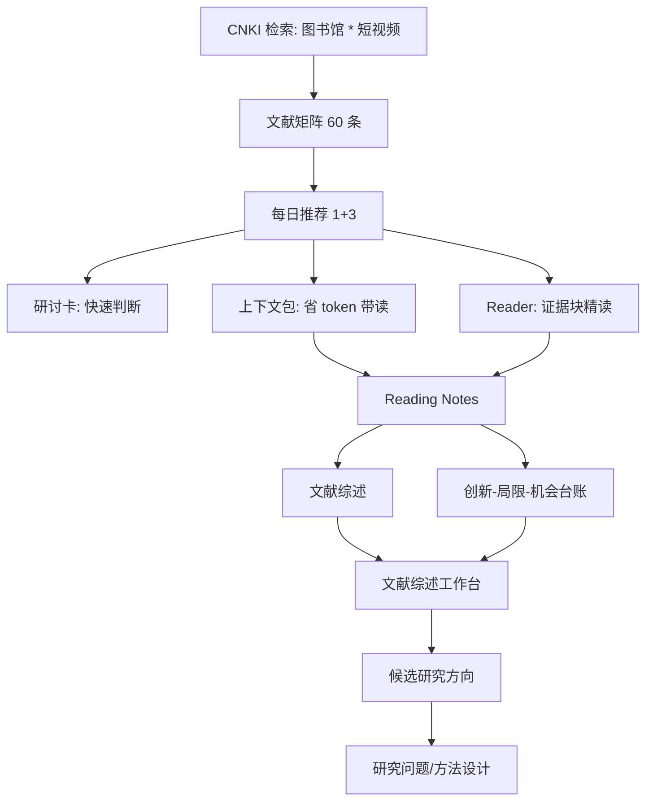

# Project Dashboard - 图书馆短视频相关研究

Last updated: 2026-07-02

## 一句话进度

这个项目已经从“准备检索”推进到“真实 CNKI 检索 + 授权全文组织 + 每日推荐 + 9 篇文献带读 + 4 篇正式 HTML 精读”。当前已收敛为一个主问题：图书馆短视频的可见平台互动，如何被转译为数字阅读推广中的可观察服务价值。

## 当前状态

| 模块 | 状态 | 位置 |
|---|---|---|
| CNKI 检索计划 | 已有 | [cnki_search_plan.md](/Users/leung/ResearchWorkflow/projects/library_short_video/literature/cnki_search_plan.md) |
| CNKI 检索结果/入库 | 项目矩阵 60 条；CNKI 检索结果曾刷新到 914 条 | [literature_matrix.csv](/Users/leung/ResearchWorkflow/library/literature_matrix.csv) |
| Fast-lane 快速快照 | 已建立；用于下一篇推荐/状态查询，减少小任务联动修改 | [library_short_video_fast_snapshot.md](/Users/leung/ResearchWorkflow/codex/runtime/library_short_video_fast_snapshot.md) |
| 授权全文 | 9 篇已组织 | [PDF 文件夹](/Users/leung/ResearchWorkflow/library/pdfs/library_short_video/) |
| CAJ 转 PDF | 当前学习集已跑通 | [CAJ 转换记录](/Users/leung/ResearchWorkflow/projects/library_short_video/literature/caj_conversion/) |
| Reader | 9/9 已生成 | [readers](/Users/leung/ResearchWorkflow/projects/library_short_video/literature/readers/README.md) |
| 论文上下文包 | 已读 8 篇已生成，用于省 token 带读 | [context_packs](/Users/leung/ResearchWorkflow/projects/library_short_video/literature/context_packs/) |
| 今日推荐 | 2026-07-02 主读已完成王兴兰、夏晓红 2021 传播力评价论文精读；下一篇优先补阅读服务类传播效果或多模态用户体验文献 | [今日精读入口](/Users/leung/ResearchWorkflow/paper_reading/today.html) |
| 今日阅读看板 | 已建立 | [reading_board.md](/Users/leung/ResearchWorkflow/projects/library_short_video/literature/reading_board.md) |
| 5 篇快速复盘 | 已生成 | [2026-06-20-five-paper-quick-recap.md](/Users/leung/ResearchWorkflow/projects/library_short_video/literature/recaps/2026-06-20-five-paper-quick-recap.md) |
| 创新/局限/机会台账 | 9 张卡片 | [innovation_limitation_bank.md](/Users/leung/ResearchWorkflow/projects/library_short_video/literature/innovation_limitation_bank.md) |
| 文献综述工作台 | 已建立；已收敛主问题、2 个子问题和“平台传播-服务触达-阅读推广结果”指标草图 | [literature_review_workbench.md](/Users/leung/ResearchWorkflow/projects/library_short_video/literature/literature_review_workbench.md) |
| 文献综述 | 已开始形成主线 | [03_literature_synthesis.md](/Users/leung/ResearchWorkflow/projects/library_short_video/03_literature_synthesis.md) |
| 证据门禁 | ERROR=0, WARN=0；metadata-only 候选只保留在补读/检索语境 | [evidence_gate_report.md](/Users/leung/ResearchWorkflow/projects/library_short_video/manuscript/evidence_gate_report.md) |

## 当前阅读进度

| 状态 | 篇数 | 含义 |
|---|---:|---|
| `skimmed` | 9 | Codex 已带读并写入 reader notes/研讨卡/综述/台账，但还不是人工逐页核验 |
| `metadata-only` | 51 | 只在候选池或尚未读完，不能作为论文主张证据 |
| `human-read` | 0 | 需要你确认已经认真读过 |
| `verified` | 0 | 需要原文页码/证据完全核验后才能标 |

## 项目流程图



## 下一步建议

1. 下一篇正式精读优先从 incoming 中选择阅读服务类传播效果或多模态用户体验文献，补服务价值指标线。
2. 把“平台传播-服务触达-阅读推广结果”指标草图细化为 claim-evidence map。
3. 用 `cnki_2021_645f03f388` 的传播力评价指标更新变量表，明确它只属于平台传播层。
4. 如果准备写论文，先写综述框架和方法设计，不直接跳到正式正文。

## 你可以直接说

- `打开今日阅读看板，告诉我这 9 篇已经读出了什么。`
- `基于上下文包，帮我快速复盘 9 篇已读论文。`
- `打开 5 篇快速复盘，再结合今天新增 2 篇帮我判断最值得做的研究方向。`
- `打开文献综述工作台，帮我整理阶段性论文工作总结。`
- `基于已收敛主问题，帮我画 claim-evidence map。`
- `明天优先精读阅读服务类传播效果论文，补服务价值指标线。`
- `打开创新局限台账，帮我找最值得做的改进点。`
- `检查这个项目距离写论文还缺什么。`

## 快捷命令

```bash
make status PROJECT=library_short_video
make fast-status PROJECT=library_short_video TOPIC="图书馆短视频相关研究" PRINT=1
make typora-project PROJECT=library_short_video DOC=reading
make lit-workbench PROJECT=library_short_video
make typora-project PROJECT=library_short_video DOC=contextpacks
make paper-context PROJECT=library_short_video ALL=1
make typora-project PROJECT=library_short_video DOC=insights
make evidence-gate PROJECT=library_short_video
```
