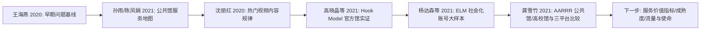

# 今日阅读看板 - 图书馆短视频相关研究

Date: 2026-06-21
Project: `library_short_video`

## 这张看板解决什么问题

你不需要去猜“论文在哪里”“研讨卡是什么”“reader 怎么读”。这张看板把今天推荐文献的入口和用途放在一起。

## 2026-06-21 今日推荐

| 角色 | Citekey | 题名 | 阅读状态 | 今天为什么读 | 入口 |
|---|---|---|---|---|---|
| 快速状态 | - | 下一篇推荐/当前进度 | - | 只查下一步时用，避免完整归档和多文件联动 | [Fast snapshot](/Users/leung/ResearchWorkflow/codex/runtime/library_short_video_fast_snapshot.md) |
| 更新后主读 | `cnki_2021_3771e58987` | 公共图书馆和高校图书馆短视频营销比较研究 | `skimmed` | 高质量来源《大学图书馆学报》；公共馆/高校馆比较 + 抖音/快手/B站平台比较 + AARRR 生命周期框架 | [上下文包](/Users/leung/ResearchWorkflow/projects/library_short_video/literature/context_packs/cnki_2021_3771e58987.md) / [Reader](/Users/leung/ResearchWorkflow/projects/library_short_video/literature/readers/cnki_2021_3771e58987/paper.md) / [研讨卡](/Users/leung/ResearchWorkflow/vault/15_CNKI_Frontier/paper_briefs/cnki_2021_3771e58987.md) |
| 今日已完成 | `cnki_2021_5530e86157` | 基于短视频营销的公共图书馆数字阅读推广策略研究 | `skimmed` | 高被引高下载；把短视频营销转译为公共图书馆数字阅读推广的情感、渠道、互动三条服务路径 | [上下文包](/Users/leung/ResearchWorkflow/projects/library_short_video/literature/context_packs/cnki_2021_5530e86157.md) / [Reader](/Users/leung/ResearchWorkflow/projects/library_short_video/literature/readers/cnki_2021_5530e86157/paper.md) / [研讨卡](/Users/leung/ResearchWorkflow/vault/15_CNKI_Frontier/paper_briefs/cnki_2021_5530e86157.md) |
| 回顾锚点 | `cnki_2021_d35f8e895a` | 图书馆短视频传播及互动效果影响因素模型及实证分析——基于“上瘾模型”的探索 | `skimmed` | 与今日主读互补：一个偏互动影响因素，一个偏数字阅读推广服务策略 | [上下文包](/Users/leung/ResearchWorkflow/projects/library_short_video/literature/context_packs/cnki_2021_d35f8e895a.md) / [Reader](/Users/leung/ResearchWorkflow/projects/library_short_video/literature/readers/cnki_2021_d35f8e895a/paper.md) / [研讨卡](/Users/leung/ResearchWorkflow/vault/15_CNKI_Frontier/paper_briefs/cnki_2021_d35f8e895a.md) |
| 下一篇候选 | `cnki_2020_5ca581e54f` | 公共图书馆短视频公众平台建设现状分析 | `metadata-only` | 现状基线补充；尚需合法全文和 reader | [下一篇推荐报告](/Users/leung/ResearchWorkflow/vault/15_CNKI_Frontier/daily_recommendations/2026-06-21-library_short_video-next-after-main.md) |

## 2026-06-20 已完成推荐的 4 篇

| 角色 | Citekey | 题名 | 阅读状态 | 今天为什么读 | 入口 |
|---|---|---|---|---|---|
| 主读 | `cnki_2021_dfab60236e` | 抖音阅读推广短视频传播效果影响因素研究 | `skimmed` | ELM + 大样本社会化阅读账号，作为外部方法模板 | [上下文包](/Users/leung/ResearchWorkflow/projects/library_short_video/literature/context_packs/cnki_2021_dfab60236e.md) / [Reader](/Users/leung/ResearchWorkflow/projects/library_short_video/literature/readers/cnki_2021_dfab60236e/paper.md) / [研讨卡](/Users/leung/ResearchWorkflow/vault/15_CNKI_Frontier/paper_briefs/cnki_2021_dfab60236e.md) |
| 伴读 | `cnki_2020_64b4f881c9` | 图书馆短视频发展现状、问题与对策分析 | `skimmed` | 2019-era 现状、问题、对策基线 | [上下文包](/Users/leung/ResearchWorkflow/projects/library_short_video/literature/context_packs/cnki_2020_64b4f881c9.md) / [Reader](/Users/leung/ResearchWorkflow/projects/library_short_video/literature/readers/cnki_2020_64b4f881c9/paper.md) / [研讨卡](/Users/leung/ResearchWorkflow/vault/15_CNKI_Frontier/paper_briefs/cnki_2020_64b4f881c9.md) |
| 伴读 | `cnki_2021_7556aafa99` | 公共图书馆“抖音”短视频服务现状及发展策略研究 | `skimmed` | 63 家公共图书馆服务地图 | [上下文包](/Users/leung/ResearchWorkflow/projects/library_short_video/literature/context_packs/cnki_2021_7556aafa99.md) / [Reader](/Users/leung/ResearchWorkflow/projects/library_short_video/literature/readers/cnki_2021_7556aafa99/paper.md) / [研讨卡](/Users/leung/ResearchWorkflow/vault/15_CNKI_Frontier/paper_briefs/cnki_2021_7556aafa99.md) |
| 伴读 | `cnki_2020_2a150c6df8` | 图书馆热门短视频内容规律探究 | `skimmed` | 328 账号、8069 视频、103 热门视频的内容规律 | [上下文包](/Users/leung/ResearchWorkflow/projects/library_short_video/literature/context_packs/cnki_2020_2a150c6df8.md) / [Reader](/Users/leung/ResearchWorkflow/projects/library_short_video/literature/readers/cnki_2020_2a150c6df8/paper.md) / [研讨卡](/Users/leung/ResearchWorkflow/vault/15_CNKI_Frontier/paper_briefs/cnki_2020_2a150c6df8.md) |

## 已读基础锚点

| Citekey | 题名 | 阅读状态 | 用途 |
|---|---|---|---|
| `cnki_2021_d35f8e895a` | 图书馆短视频传播及互动效果影响因素模型及实证分析——基于“上瘾模型”的探索 | `skimmed` | 图书馆官方账号 + Hook Model + 879 视频，是当前最重要的领域基础文献 |

入口：[上下文包](/Users/leung/ResearchWorkflow/projects/library_short_video/literature/context_packs/cnki_2021_d35f8e895a.md) / [Reader](/Users/leung/ResearchWorkflow/projects/library_short_video/literature/readers/cnki_2021_d35f8e895a/paper.md) / [研讨卡](/Users/leung/ResearchWorkflow/vault/15_CNKI_Frontier/paper_briefs/cnki_2021_d35f8e895a.md)

## 论文带读上下文包是什么

上下文包是“省 token 的带读小包”。它从 Reader、研讨卡和创新-局限台账里抽取最关键的信息，避免每次共读都重新加载完整全文。

优先用它做：

- 复盘一篇论文的核心内容。
- 比较多篇论文的贡献和局限。
- 让 Codex 快速进入带读状态。

需要核验证据、补页码、查看完整段落时，再打开 Reader。

上下文包入口在：

```text
projects/library_short_video/literature/context_packs/
```

## 研讨卡是什么

研讨卡是“读前/读后快速判断卡”。它不替代全文，但帮你快速回答：

- 这篇文章讲什么？
- 它为什么值得读？
- 它的方法和证据强不强？
- 它对我的项目是背景、方法、理论、变量，还是反面提醒？
- 如果以后写论文，哪些 block 可以回原文核验？

研讨卡入口在：

```text
vault/15_CNKI_Frontier/paper_briefs/
```

## Reader 是什么

Reader 是“带证据定位的全文阅读材料”。目前 CNKI reader 主要包含：

- 元数据
- Extracted Blocks: `B0001`, `B0002`, ...
- Reading Notes: Codex 带读后的摘要、方法、创新、证据块、局限
- Use Boundary: 明确它还不是 `human-read` 或 `verified`

当我要带你读论文时，我会优先用 Reader 的 block IDs，而不是凭题名或摘要猜。

## 创新-局限-机会台账有什么用

入口：[innovation_limitation_bank.md](/Users/leung/ResearchWorkflow/projects/library_short_video/literature/innovation_limitation_bank.md)

这不是普通读书笔记，而是选题素材库。每篇读过的论文会沉淀：

- 可复用创新点
- 关键局限性
- 可转化研究问题
- 跨文献机会地图

今天读完后，台账已有 7 张卡片。当前最有潜力的方向包括：

1. 平台互动指标与图书馆服务价值之间的断裂。
2. Hook Model 与 ELM 是否能整合成图书馆短视频机制框架。
3. 图书馆官方账号与社会化阅读账号的可迁移差异。
4. 公共图书馆与高校图书馆在平台选择和内容定位上的差异。
5. 热点/情绪/名人带来的流量，是否真的服务图书馆使命。
6. 用 2024-2026 数据复测早期研究结论。

## 今天形成的阅读主线



## 读完之后去哪里看成果

| 成果 | 入口 | 用处 |
|---|---|---|
| 今日完成情况 | [今日更新推荐报告](/Users/leung/ResearchWorkflow/vault/15_CNKI_Frontier/daily_recommendations/2026-06-21-library_short_video-after-refresh.md) | 确认更新后主读和后续候选 |
| 5 篇快速复盘 | [2026-06-20-five-paper-quick-recap.md](/Users/leung/ResearchWorkflow/projects/library_short_video/literature/recaps/2026-06-20-five-paper-quick-recap.md) | 快速理解已读 5 篇的角色、主线、共同缺口和选题方向 |
| 跨文献主线 | [03_literature_synthesis.md](/Users/leung/ResearchWorkflow/projects/library_short_video/03_literature_synthesis.md) | 看项目综述如何逐步形成 |
| 文献综述工作台 | [literature_review_workbench.md](/Users/leung/ResearchWorkflow/projects/library_short_video/literature/literature_review_workbench.md) | 把已读文献整理成逐篇结论、逻辑分类、综述线索和阶段性论文工作总结 |
| 选题线索 | [innovation_limitation_bank.md](/Users/leung/ResearchWorkflow/projects/library_short_video/literature/innovation_limitation_bank.md) | 从创新和局限挖研究问题 |
| 证据安全 | [evidence_gate_report.md](/Users/leung/ResearchWorkflow/projects/library_short_video/manuscript/evidence_gate_report.md) | 防止把未读文献误写成论文证据 |

## 下一次怎么继续

你可以直接说：

```text
打开今日阅读看板，基于已读 5 篇帮我收敛研究方向。
```

或者：

```text
打开文献综述工作台，基于已读文献帮我整理阶段性论文工作总结。
```

或者：

```text
基于主读论文的上下文包，带我复盘它的核心内容和研究机会。
```

或者：

```text
继续读剩下两篇 reader，并补到综述和创新局限台账。
```
