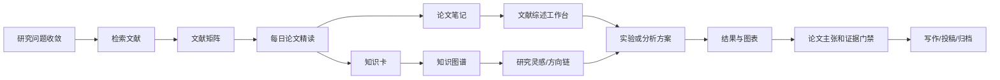

# 科研工作流

Last updated: 2026-06-28

## 总体链路



## 每日闭环

1. 早上 9 点：推荐 1 篇论文，生成可视化精读页。
2. 同步沉淀：更新论文笔记、概念卡、方法卡、复习问题和知识图谱关系。
3. 白天学习：从 `study_dashboard.html` 进入论文、知识卡、图谱和项目行动。
4. 晚上 8 点：更新学习日志，检查归档、孤立文件、图谱导出和仪表盘。

## 模块接口

| 模块 | 输入 | 输出 | 下游 |
|---|---|---|---|
| 论文精读 | 用户兴趣、项目阶段、候选论文 | `paper_reading/*.html`、`vault/01_Literature/*.md` | 知识卡、综述、图谱 |
| 知识卡 | 论文中的概念、理论、方法、指标 | `vault/02_Concepts/*.md`、`vault/03_Methods/*.md` | 复习队列、图谱、Idea Lab |
| 知识图谱 | Obsidian 双链和知识索引 | `vault/13_Knowledge_Graph/*.csv`、`knowledge_graph/index.html` | 灵感发现、学习导航 |
| 学习日志 | 当天新增/修改文件和学习过程 | `logs/*.html`、`vault/12_Learning_Log/sessions/*.md` | 周复盘、明日任务 |
| 项目工作台 | 已读文献、方法、证据、想法 | 项目看板、综述、创新局限台账 | 实验、写作、投稿 |

## 操作入口

- 可视化总入口：`study_dashboard.html`
- 论文精读固定入口：`paper_reading/today.html`
- 论文精读归档：`paper_reading/index.html`
- 知识卡入口：`knowledge_cards/index.html`
- 知识图谱入口：`knowledge_graph/index.html`
- 学习日志入口：`logs/index.html`

## 维护命令

```bash
make obsidian-graph
make learning-dashboard
```

更详细的衔接规范见：

```text
docs/INTEGRATED_RESEARCH_LEARNING_WORKFLOW.md
```
