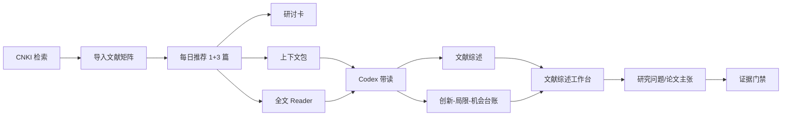
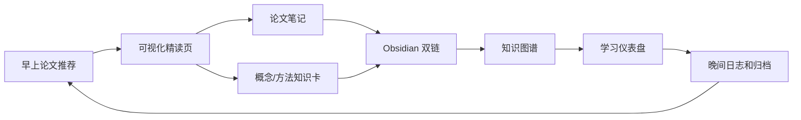
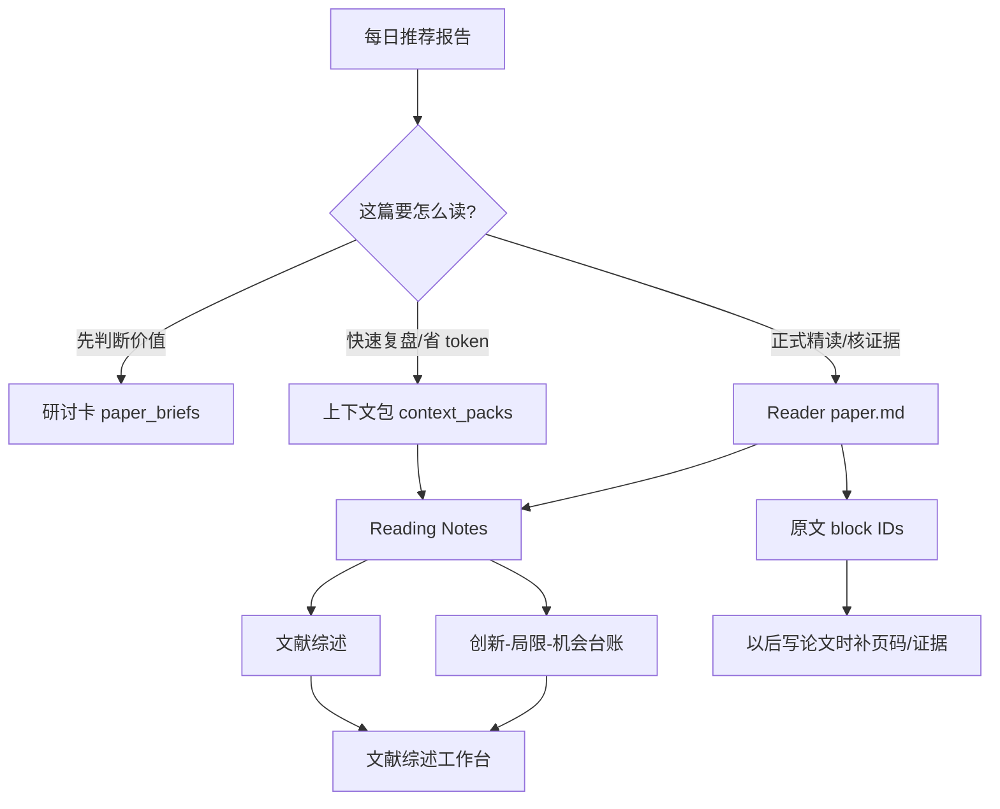

# 科研工作流首页

Last updated: 2026-06-30

这页是入口，不是档案库。你每天只需要从这里进入，或者直接对 Codex 说一句自然语言。

## 今天从哪里开始

| 我想做什么 | 打开哪里 | 直接对 Codex 怎么说 |
|---|---|---|
| 打开可视化学习总入口 | [学习仪表盘](/Users/leung/ResearchWorkflow/study_dashboard.html) | `打开我的学习仪表盘，告诉我今天该从哪里开始。` |
| 查看当前工作流总状态 | [工作流总状态](/Users/leung/ResearchWorkflow/workflow_state.html) | `打开工作流总状态，告诉我当前最该处理什么。` |
| 查看今天行动队列 | [行动队列](/Users/leung/ResearchWorkflow/action_queue.html) | `打开行动队列，按优先级告诉我今天先做什么。` |
| 查看项目协作分工 | [项目协作层](/Users/leung/ResearchWorkflow/project_collaboration.html) | `打开项目协作层，告诉我哪些需要我确认，哪些你可以继续做。` |
| 查看自动归档策略 | [自动归档策略](/Users/leung/ResearchWorkflow/archive_policy.html) | `打开自动归档策略，告诉我哪些文件需要归档或清理。` |
| 打开今日精读固定入口 | [今日精读入口](/Users/leung/ResearchWorkflow/paper_reading/today.html) | `打开今天的精读入口，直接带我读你今天推荐的主论文。` |
| 看论文精读归档 | [论文精读归档](/Users/leung/ResearchWorkflow/paper_reading/index.html) | `打开论文精读归档，我想回看前几天的主读论文。` |
| 看知识卡和复习队列 | [知识卡入口](/Users/leung/ResearchWorkflow/knowledge_cards/index.html) / [今日复习入口](/Users/leung/ResearchWorkflow/knowledge_cards/review_today.html) | `根据今天新学的概念，带我复习知识卡。` |
| 看知识之间的关系 | [知识图谱入口](/Users/leung/ResearchWorkflow/knowledge_graph/index.html) | `从知识图谱里解释这篇论文和已有知识的关系。` |
| 搜索论文、概念、方法和项目材料 | [全局搜索入口](/Users/leung/ResearchWorkflow/search/index.html) | `搜索我的研究工作流里和 AARRR 或 SICAS 有关的材料，并按相关度排序。` |
| 看工作流分层架构 | [分层架构契约](/Users/leung/ResearchWorkflow/paper_reading/views/workflow_layered_architecture.html) | `打开分层架构契约，告诉我现在系统各层怎么分工。` |
| 快速看下一步，不触发完整归档 | [快速运行快照](/Users/leung/ResearchWorkflow/paper_reading/views/library-short-video-fast-snapshot-d2e5e287.html) | `用快速模式告诉我下一篇该读什么。` |
| 看当前项目进度 | [图书馆短视频项目看板](/Users/leung/ResearchWorkflow/paper_reading/views/00-project-dashboard-dd8418ad.html) | `打开图书馆短视频项目看板，告诉我下一步做什么。` |
| 看当前阅读安排 | [当前阅读看板](/Users/leung/ResearchWorkflow/paper_reading/views/reading-board-026f6ec8.html) | `打开阅读看板，带我读下一篇。` |
| 看上一轮推荐报告原文 | [2026-06-20 CNKI 每日推荐](/Users/leung/ResearchWorkflow/paper_reading/views/2026-06-20-library-short-video.html) | `打开最近的 CNKI 推荐报告。` |
| 快速复盘一篇已读论文 | [论文带读上下文包](/Users/leung/ResearchWorkflow/paper_reading/views/directories/context-packs-4b4dd996.html) | `基于这篇论文的上下文包带我复盘核心内容。` |
| 看某篇论文的精读材料 | [Reader 文件夹](/Users/leung/ResearchWorkflow/paper_reading/views/readme-184a812b.html) | `打开这篇论文的 reader，并带我过核心内容。` |
| 看每篇论文的研讨卡 | [论文研讨卡文件夹](/Users/leung/ResearchWorkflow/paper_reading/views/directories/paper-briefs-6a749cd8.html) | `打开这篇论文的研讨卡，告诉我它值不值得精读。` |
| 看创新点和局限性如何变成选题 | [创新-局限-机会台账](/Users/leung/ResearchWorkflow/paper_reading/views/innovation_limitation_bank.html) | `从创新局限台账里帮我挖 3 个可研究问题。` |
| 把多篇文献整理成综述线索和论文工作总结 | [文献综述工作台](/Users/leung/ResearchWorkflow/paper_reading/views/literature_review_workbench.html) | `打开文献综述工作台，帮我整理阶段性论文工作总结。` |
| 看已经形成的综述判断 | [文献综述](/Users/leung/ResearchWorkflow/paper_reading/views/literature_synthesis.html) | `根据目前已读文献，帮我整理研究主线。` |

## 你现在有什么功能

| 功能 | 它解决什么问题 | 你怎么看/怎么用 |
|---|---|---|
| CNKI 检索入库 | 把你感兴趣领域的知网论文整理进长期文献库 | 让 Codex 搜索/导入；结果在 `library/literature_matrix.csv` |
| 每日推荐 | 每天给你 1 篇主读 + 3 篇伴读，按高价值基础文献到新研究推进 | 看 [今日阅读看板](/Users/leung/ResearchWorkflow/paper_reading/views/reading-board-026f6ec8.html) |
| 论文上下文包 | 把 Reader、研讨卡、创新局限压缩成带读小包，减少 token 浪费 | 看 `projects/<project>/literature/context_packs/` |
| 研讨卡 | 快速判断一篇论文讲什么、值不值得精读、有什么问题 | 看 `vault/15_CNKI_Frontier/paper_briefs/` |
| Reader | 面向精读的 source-grounded 原文抽取材料，有 block ID 可追溯 | 看 `projects/<project>/literature/readers/<citekey>/paper.md` |
| Codex 带读 | 不是让你自己摸索，而是我带你过摘要、方法、结论、创新、局限 | 对 Codex 说 `带我读这篇 reader` |
| 文献综述 | 把单篇阅读变成跨文献主题、方法、理论和证据表 | 看项目 `03_literature_synthesis.md` |
| 文献综述工作台 | 把截图式提示词固化为逐篇结论、逻辑分类、综述线索和论文工作总结 | 看项目 `literature/literature_review_workbench.md` |
| 创新-局限-机会台账 | 把每篇文章的创新和局限沉淀成后续选题线索 | 看项目 `literature/innovation_limitation_bank.md` |
| 证据门禁 | 防止 metadata-only 或未读文献被误用成论文证据 | 看 [证据门禁报告](/Users/leung/ResearchWorkflow/paper_reading/views/evidence-gate-report-7607e392.html) |
| 全局搜索 | 从一个入口检索论文页、知识卡、项目文件、日志和图谱展示资产 | 看 [全局搜索入口](/Users/leung/ResearchWorkflow/search/index.html) |
| 工作流总状态 | 聚合项目、复习、搜索、图谱、审计和下一步动作 | 看 [工作流总状态](/Users/leung/ResearchWorkflow/workflow_state.html) |
| 行动队列 | 把审计、复习和项目建议转成按优先级排列的开放行动 | 看 [行动队列](/Users/leung/ResearchWorkflow/action_queue.html) |
| 项目协作层 | 把用户待确认事项、Codex 可执行事项和项目入口放在同一页 | 看 [项目协作层](/Users/leung/ResearchWorkflow/project_collaboration.html) |
| 自动归档策略 | 报告备份、日志、生成页和缓存文件的保留/清理策略 | 看 [自动归档策略](/Users/leung/ResearchWorkflow/archive_policy.html) |
| 上下文和日志 | 防止长对话丢失，保证下次能接着做 | Codex 自动维护 `codex/state/` 和 `vault/07_Codex_Logs/` |
| Fast-lane 快速状态 | 只查下一篇/当前状态时避免触发完整归档链 | 看 `codex/runtime/<project>_fast_snapshot.md`，或说 `用快速模式` |

## 每日学习闭环

原则：论文不是孤立摘要。每篇新精读论文都要同步沉淀为知识卡、图谱关系、复习问题和下一步研究动作。

## 论文材料怎么看

阅读顺序建议：

1. 先看 [今日阅读看板](/Users/leung/ResearchWorkflow/paper_reading/views/reading-board-026f6ec8.html)。
2. 快速复盘或继续共读时，先看某篇的上下文包。
3. 再看某篇的研讨卡，确认它在今天任务里的角色。
4. 需要核验证据、补页码、做全文精读时打开 Reader。
5. 读完后看文献综述和创新台账，确认这篇文章给你的研究留下了什么。

## 当前主项目

- Project: `library_short_video`
- Topic: 图书馆短视频相关研究
- 当前状态：CNKI 项目矩阵 60 条，8 篇授权全文/Reader，8 篇 source-grounded skimmed，并已补出 SICAS 与 AARRR 两篇论文精读 HTML。
- 今日任务：把 AARRR 与 SICAS 对齐成“用户路径 + 阶段指标”，继续收敛研究问题、指标框架和项目可执行下一步。
- 下一步：先用文献综述工作台收敛研究问题，或继续补读 `cnki_2021_645f03f388`。

## 常用自然语言

- `继续我的科研工作流，先打开首页和项目看板。`
- `打开工作流总状态，告诉我当前最该处理什么。`
- `打开行动队列，按优先级告诉我今天先做什么。`
- `打开项目协作层，区分哪些事情需要我确认，哪些你可以继续推进。`
- `打开自动归档策略，告诉我当前备份、日志和缓存文件状态。`
- `用快速模式告诉我下一篇该读什么，不要做完整归档。`
- `今天我应该读哪篇论文？为什么？`
- `打开今天的阅读看板，按顺序带我读。`
- `基于这篇论文的上下文包带我复盘核心内容。`
- `这篇论文的研讨卡是什么？它对我有什么帮助？`
- `打开这篇论文的 reader，带我过摘要、方法、结论、创新和局限。`
- `从创新-局限台账里帮我找新的研究问题。`
- `打开文献综述工作台，帮我整理阶段性论文工作总结。`
- `搜索我的研究工作流里和 AARRR、SICAS、传播力指标有关的材料，并显示命中片段。`
- `我现在一头雾水，帮我用用户视角解释当前项目文件。`

## 其他入口

- [[科研工作流]]
- [[可视化使用指南]]
- [[文献阅读规范]]
- [[图表规范]]
- [[11_Idea_Lab/README]]
- [Codex-first 协作协议](/Users/leung/ResearchWorkflow/codex/OPERATING_PROTOCOL.md)
